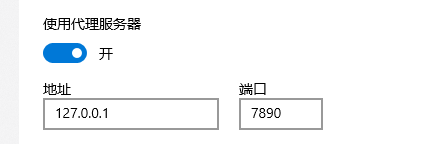

## 本地项目首次与 github 项目关联

```
git remote add origin https----
```

## 拉取远程代码

```
git pull origin main
```

## 提交远程代码

```
git push origin main

```

## 提交代码 报错 OpenSSL SSL_read: Connection was reset, errno 10054

### 本地打开代理
  

### 执行以下命令再重新提交
```

git config --global http.proxy 127.0.0.1:7890
git config --global https.proxy 127.0.0.1:7890

```
